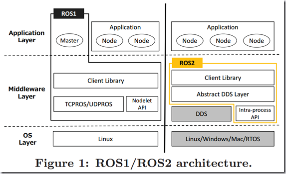
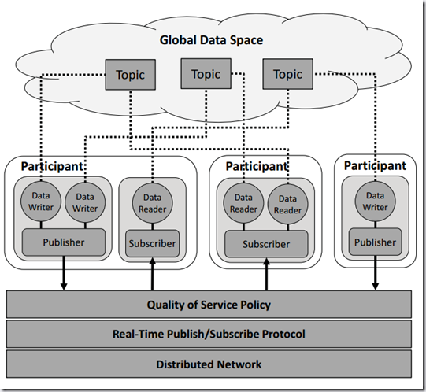
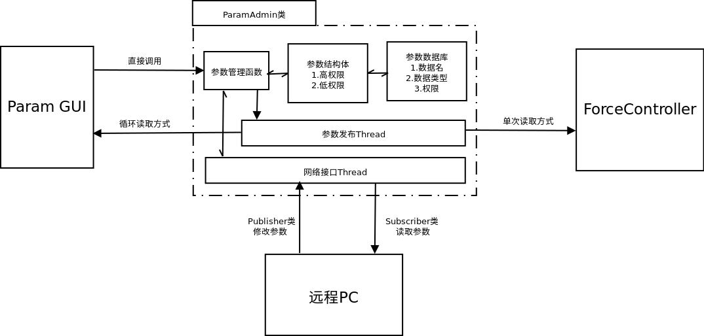

# ParamManager设计文档

### *0x00 ROS1.0与2.0的参数管理器*
&emsp;&emsp;目标是设计一款能够实现通过网络来管理参数功能的参数管理器，已知比较成熟的即ROS架构内的参数管理器。  
&emsp;&emsp;观察是否有[可借鉴的地方](http://www.guyuehome.com/1228):
<div align=center>

<div align=left>  

***1、节点管理器***  
&emsp;&emsp;在ROS1.0中，节点之间的通讯需要借助ROS Master，即每次运行前的:  

```
$ roscore
```
&emsp;&emsp;而ROS2.0靠一种[自动发现的机制](https://blog.csdn.net/tuxinbang1989/article/details/87901143)——Discovery。什么意思呢？简单来说，当一个节点启动后，首先在网络中发条广播，大声告诉这个世界我来了，其他节点听到之后，也纷纷反馈各自的信息，这样一来二去也就联系上了。当然，万一哪个节点掉线了怎们办？没关系，每个节点都会周期性的发布广播，告诉其他节点他还在线，就算要下线，他也会广播告诉其他节点他要走了，下次再聊。总之，发现（Discovery）可以理解为一种身份声明和响应的机制。
&emsp;&emsp;可以看出有点像路由器的机制，每个节点就变成了具有特定IP的终端。  

***2、通讯机制***  
&emsp;&emsp;从图中可以看出ROS1.0通讯机制仍然是TCP;而ROS2.0变为了DDS(数据分发服务)，目前已成为**分布式实时系统**中数据发布/订阅的标准解决方案。  
&emsp;&emsp;两个很重要的独立模块“Nodelet”和“Intra-process”。在ROS1的架构中Nodelet和TCPROS/UDPROS是并列的层次，负责通讯，实际上Nodelet是为同一个进程中的多个节点提供一种更优化的数据传输方式。
ROS2中保留了这种数据传输方式，只不过换了一个名字，叫“Intra-process”，同样也是独立于DDS。其通讯过程如下图所示:
<div align=center>

<div align=left>  

&emsp;&emsp;与ROS1不同的地方在于，多了两个数据处理对象:1)数据写入器（DataWriter）。发布者向全局数据空间更新数据的对象，每个数据写入器对应一个特定的Topic，类似于ROS1中的一个消息发布者;2)数据读取器（DataReader）。订阅者从全局数据空间读取数据的对象，每个数据读取器对应一个特定的Topic，类似于ROS1中的一个消息订阅者。

### *0x01 设计文档-总体架构*
&emsp;&emsp;服务端的参数管理类为ParamAdmin，其主要包括四个部分:1)参数修改函数;2)参数发布Thread与发布函数、参数修改Thread。前者用于向外部发送参数数据，后者用于接受外部修改参数的请求;3)参数结构体，包含所有当前参数的信息，包括参数名、数值以及访问权限;4)参数数据库，用于保存当前数据（可以先放着不做）。  
&emsp;&emsp;客户端主要有两种:1)数据写入器(DataWriter)，通过TCP/IP写入参数数据;2)数据读取器(DataReader)，其实现两个功能，包括循环读取数据以及单次读取数据。循环读取具体的实现方式为开启一个读取线程。
<div align=center>

<div align=left>  

### *0x02 设计文档-函数接口*
```
1 服务端
  1.1 参数修改函数
  1.2 参数发布Thread与发布函数
  1.3 发布函数
  1.4 参数修改Thread
  1.5 数据结构体
  1.6 线程开关
2 客户端-DataWriter
  2.1 数据写入初始化
  2.2 数据写入
3 客户端-DataReader
  3.1 数据读取器初始化
  3.2 单次数据读取
  3.3 循环数据读取
  3.4 线程开关
```
***1、服务端***  
***1.1、参数修改函数***  
&emsp;&emsp;函数类型:Private  
&emsp;&emsp;函数名:bool modifyParam(std::string paramName,double& val,bool power)  
&emsp;&emsp;参数:paramName/参数名，val/数值(均为double类型)，power/权限(控制远程PC修改该参数的权限)  

***1.2、参数发布Thread***  
&emsp;&emsp;函数类型:Private  
&emsp;&emsp;函数名:void paramPublishThread(double publishTime)  
&emsp;&emsp;参数:publishTime/发布时间间隔，单位s

***1.3、发布函数***  
&emsp;&emsp;函数类型:Private  
&emsp;&emsp;函数名:void Publisher::publish(double publishTime)  
&emsp;&emsp;参数:publishTime/发布时间间隔，单位s

***1.4、参数修改Thread***  
&emsp;&emsp;函数类型:Private  
&emsp;&emsp;函数名:void paramModifyThread(double publishTime)  
&emsp;&emsp;参数:publishTime/发布时间间隔，单位s

***1.5、数据结构体***  
&emsp;&emsp;函数类型:Public  
&emsp;&emsp;函数名:struct dataMessage{  
&emsp;&emsp;&emsp;&emsp;&emsp;&emsp;std::string paramName  
&emsp;&emsp;&emsp;&emsp;&emsp;&emsp;double val  
&emsp;&emsp;&emsp;&emsp;&emsp;&emsp;bool power}  
&emsp;&emsp;参数:paramName/参数名，val/数值，power/修改权限

***1.6、线程开关***  
&emsp;&emsp;函数类型:Public  
&emsp;&emsp;函数名:bool threadSwitch(bool openThread)  
&emsp;&emsp;参数:openThread/是否打开线程

***2、客户端-DataWriter***  
***2.1、数据写入初始化***  
&emsp;&emsp;函数类型:Public  
&emsp;&emsp;函数名:bool initDataWriter(std::string& host)  
&emsp;&emsp;参数:host/远程服务端IP

***2.2、数据写入***  
&emsp;&emsp;函数类型:Public  
&emsp;&emsp;函数名:bool dataWrite(const void* paramName,double& val)  
&emsp;&emsp;参数:paramName/参数名，val/数值(均为double类型)

***3、客户端-DataReader***  
***3.1、数据读取器初始化***  
&emsp;&emsp;函数类型:Public  
&emsp;&emsp;函数名:bool initDataReader(std::string& host,const void* paramName)  
&emsp;&emsp;参数:host/远程服务端IP，paramName/参数名

***3.2、单次数据读取***  
&emsp;&emsp;函数类型:Public  
&emsp;&emsp;函数名:double dataReadOnce()  
&emsp;&emsp;返回值:double类型的数值

***3.3、循环数据读取***  
&emsp;&emsp;函数类型:Public  
&emsp;&emsp;函数名:bool dataReadRepeat(double RepeatTime)  
&emsp;&emsp;RepeatTime/循环读取的时间，单位s

***3.4、线程开关***  
&emsp;&emsp;函数类型:Public  
&emsp;&emsp;函数名:bool threadSwitch(bool openThread)  
&emsp;&emsp;参数:openThread/是否打开线程
